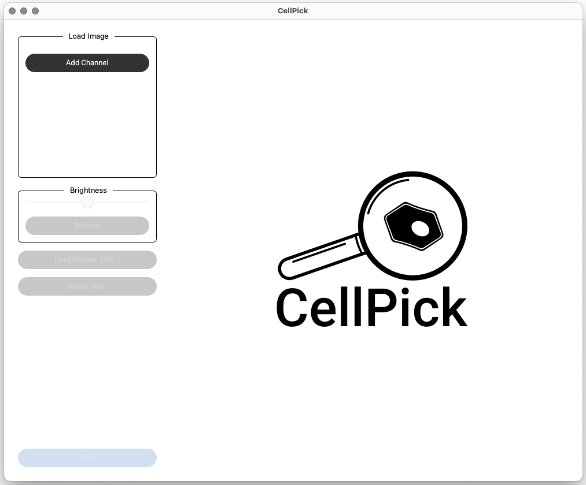

Launch
======

Once installed, simply launch CellPick from your terminal:

.. code-block:: bash

   cellpick

This will open the graphical user interface.

.. raw:: html

   

For detailed usage information, see the :doc:`workflow` documentation.

