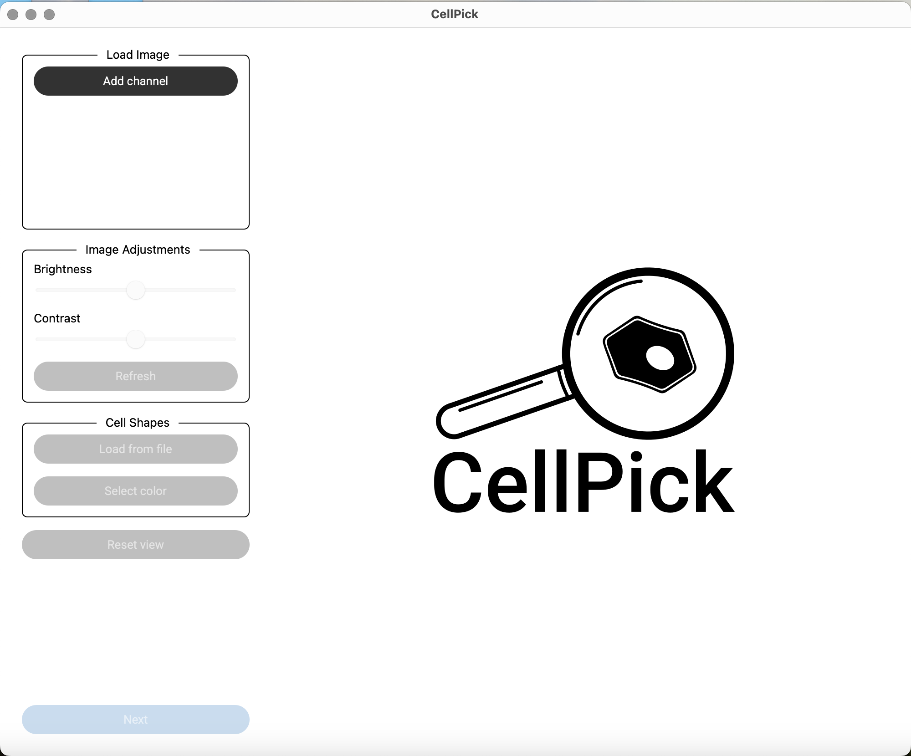

Workflow
========

.. raw:: html

   

After correctly installing and launching CellPick, you'll face a welcome screen with some file loading options.

.. raw:: html

   

The typical workflow in CellPick consists of the following steps:

1. **Load Image Channels**

   After launching CellPick, you will be presented with a blank canvas with a few buttons on the left.

   - Click "Add Channel" to load one or more microscopy images (CellPick currently supports TIFF and CZI formats). If your file contains more than one channel, CellPick will load them all sequentially.
   - You'll be prompted with two dialogue boxes per channel, to select a name and a colour.
   - Adjust channel visibility brightness as needed using the slider on the left.
   - You can turn channels on and off by clicking the box next to each channel name.
   - To completely delete a channel, you can just click on the cross to the right of the channel's name.

   .. note::
      Once a channel is loaded, you can rename it by clicking on it's name, or recolour it by clicking on the colour box on the right.

   .. image:: _assets/workflow_step1_load_channels.png
      :alt: Load Image Channels UI
      :width: 800

   .. raw:: html

      

2. **Load Shapes**

   Next, you need to load an XML file containing the shapes you want to annotate and potentially cut out.

   - Click "Load Shapes (XML)" to import pre-existing shape annotations. This will prompt you with two subsequent file explorer windows, to select the XML file containing the shapes and the calibration file that aligns them with the image.

   .. image:: _assets/workflow_step2_load_shapes.png
      :alt: Load Shapes Dialog
      :width: 800

   .. raw:: html

      

3. **Proceed to Annotation**

   - Click "Next" to move to the annotation page. You should see a completely new menu on the left.
   - You can always go back to the previous menu by clicking "Home" on the left.

   .. image:: _assets/workflow_step3_next_annotation.png
      :alt: Proceed to Annotation
      :width: 800

   .. raw:: html

      

4. **Active Region Selection**

   To select and score cells, you should define an active region (AR) within the image. Only cells within the AR will be further annotated.

   - Add an active region by clicking "Add AR" and selecting points by right-clicking anywhere on the image. Points will be highlighted in yellow.
   - You can delete the last point by clicking "Delete last point" on the corresponding menu.
   - If you want to delete the entire AR, click "Delete AR" and right-click on the AR polygon to remove.

   .. image:: _assets/workflow_step4_active_region.png
      :alt: Active Region Selection
      :width: 800

   .. raw:: html

      

5. **Landmark Selection**

   You can optionally add up to two landmarks to the image. Cells will be automatically endowed with a score based on the distance to the landmarks.

   - Add up to two landmarks by clicking "Add Landmark" and selecting points on the image (right-click).
   - Confirm each landmark when done. The clicked points will turn into a solid polygon in the image.
   - Analogously to the AR, you can delete the last point by clicking "Delete last point" on the corresponding menu while selecting.
   - If you want to delete the entire landmark, click "Delete Landmark" and right-click on the landmark polygon to remove.

   .. image:: _assets/workflow_step5_landmark_selection.png
      :alt: Landmark Selection
      :width: 800

   After both active region and landmarks are selected, cells will be automatically assigned a location-based score proportional to the distance between both landmarks. 
   Cells with a high score will be rendered green, and cells with a low score will be coloured red.

   .. image:: _assets/workflow_step6_gradient.png
      :alt: Gradient assignment
      :width: 800

   .. raw:: html

      

6. **Shape Selection and Editing**

   Finally, you can now select shapes within the predefined active region.

   - Use "Automatic Selection" to select as many shapes as indicated by the corresponding counter within the specified active region.
   - Add or remove shapes manually using the "Add" and "Delete" buttons.

   .. image:: _assets/workflow_step7_shape_selection.png
      :alt: Shape Selection
      :width: 800

   .. raw:: html

      

7. **Multiple Active Regions**

   CellPick can handle an arbitrary number of active regions. In this case, the user can choose whether to select a number of cells from the union of the selected regions:

   .. image:: _assets/workflow_step8_union.png
      :alt: Multiple Active Regions (union)
      :width: 800

   .. raw:: html

      

   or for each region independently:

   .. image:: _assets/workflow_step9_per_region.png
      :alt:  Multiple Active Regions (per region)
      :width: 800

   .. raw:: html

      

8. **Export/Save Results**

   Once you are satisfied with the set of selected cells, you can click on the green `Export Selected` button within the shape selection box.
   This will prompt you with a saving window and ask you for a base name. The saving pipeline will result in two files:

   - `<save_prefix>.xml` is a subsetted XML in the same format as the input, containing only the selected cells. The file is compatible with any downstream LMD pipelines.
   - `<save_prefix>.csv` is a tabular file containing cell IDs (matching those in the XML) alongside their corresponding spatial score.