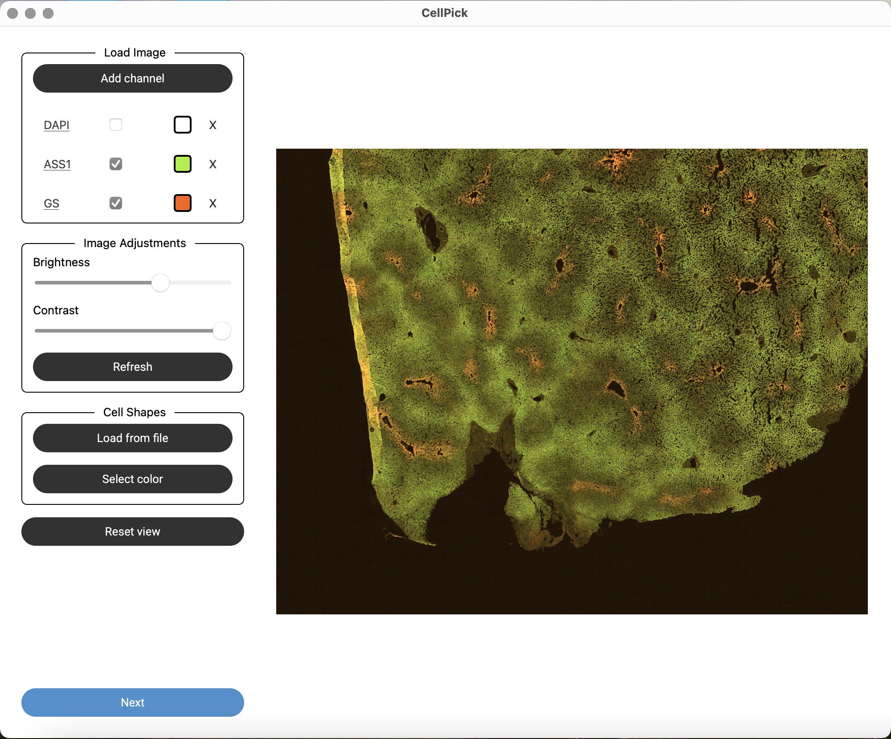
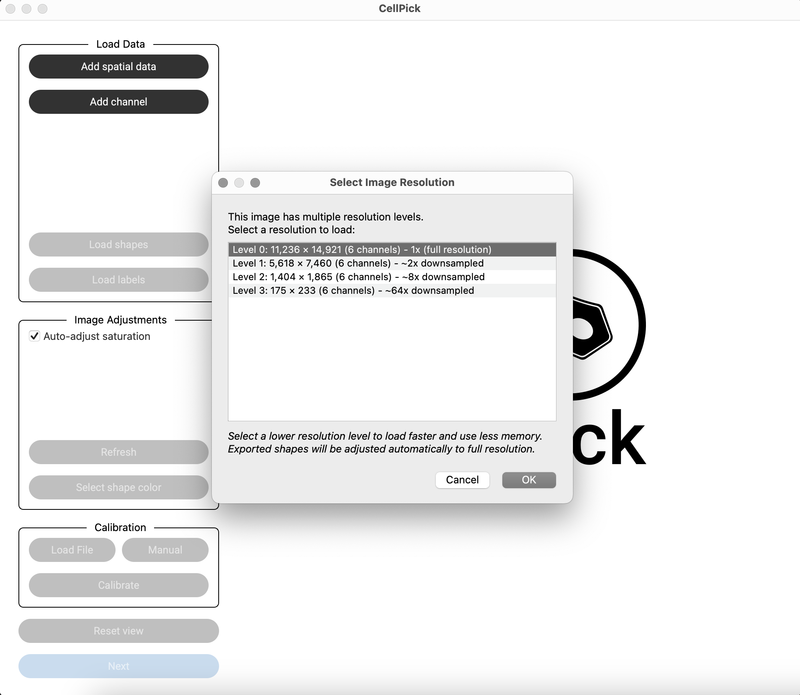
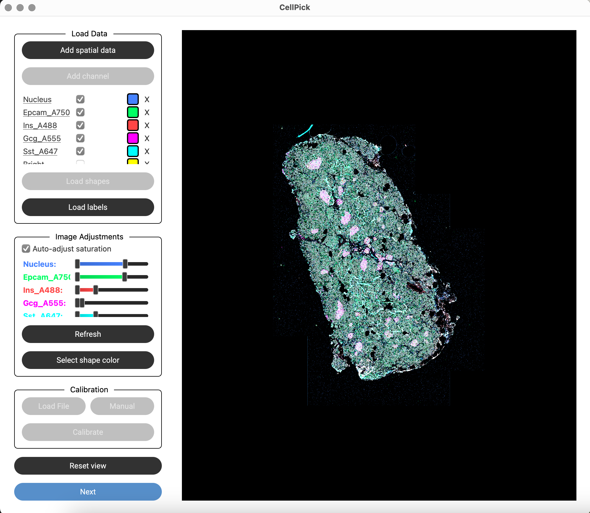

Step 1: Load Data
=================

CellPick supports two main workflows for loading data:

Option A: Traditional Image + XML Workflow
------------------------------------------

This workflow is ideal for users who have microscopy images and pre-computed shape annotations in XML format.

Add Image Channels
^^^^^^^^^^^^^^^^^^

- Click **"Add Channel"** to load one or more microscopy images
- Supported formats: TIFF (.tif, .tiff) and CZI (.czi)
- If your file contains multiple channels, CellPick will load them all sequentially
- For each channel, you'll be prompted to:
  - Enter a name for the channel
  - Select a display color

.. raw:: html

   

Load Shapes
^^^^^^^^^^^

- Click **"Load Shapes"** to import pre-existing shape annotations
- This opens two sequential file dialogs:
  1. Select the XML file containing shape coordinates
  2. Select the calibration/metadata file for alignment

.. image:: ../_assets/workflow_step2_load_shapes.png
   :alt: Load Shapes Dialog
   :width: 800

.. raw:: html

   

Option B: SpatialData Workflow
------------------------------

This workflow is for users working with SpatialData (.zarr) stores, which can contain images, segmentation masks, shapes, and annotations in a unified format.

Loading SpatialData
^^^^^^^^^^^^^^^^^^^

- Click **"Add Spatial Data"** to load a .zarr store
- CellPick will detect available elements:
  - **Images**: Multi-channel microscopy images
  - **Labels**: Segmentation masks (cell boundaries)
  - **Shapes**: Pre-computed polygon shapes
  - **Tables**: Annotation tables with cell labels

- For multi-resolution images, you'll be prompted to select a resolution level:
  - Higher resolution = more detail but slower loading
  - Lower resolution = faster loading, automatic upscaling on export

.. note::
   SpatialData support requires the ``spatialdata`` package. See :doc:`../installation` for details.

.. raw:: html

   

For multi-resolution images, you'll be prompted to select a resolution level:

.. raw:: html

   

Once loaded, all channels appear in the control panel with per-channel visibility and saturation controls:

.. raw:: html

   

