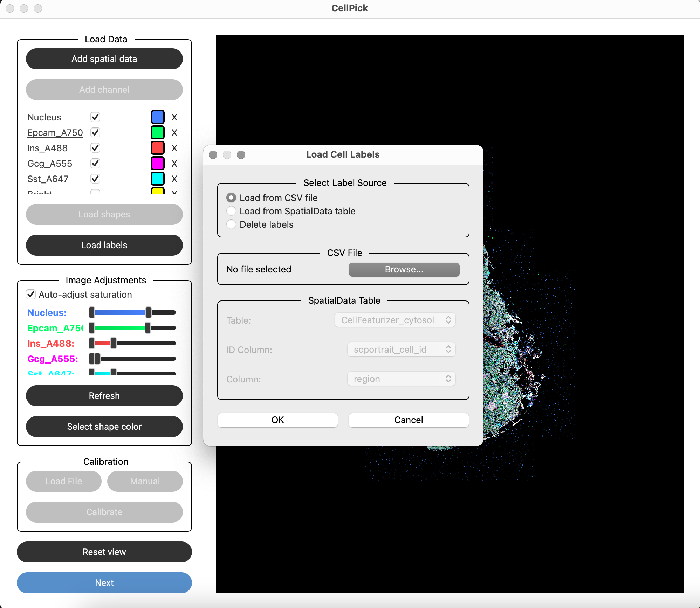

Step 4: Load Labels (Optional)
==============================

CellPick supports loading cell type labels for stratified selection:

- Click **"Load Labels"** to import a CSV file with cell annotations
- The CSV should contain:
  - A column with cell IDs (matching shape IDs or original mask IDs)
  - A column with label values (e.g., cell types)
- Labels are used for:
  - Color-coding shapes by cell type
  - Stratified selection (select k cells per label)

.. raw:: html

   

