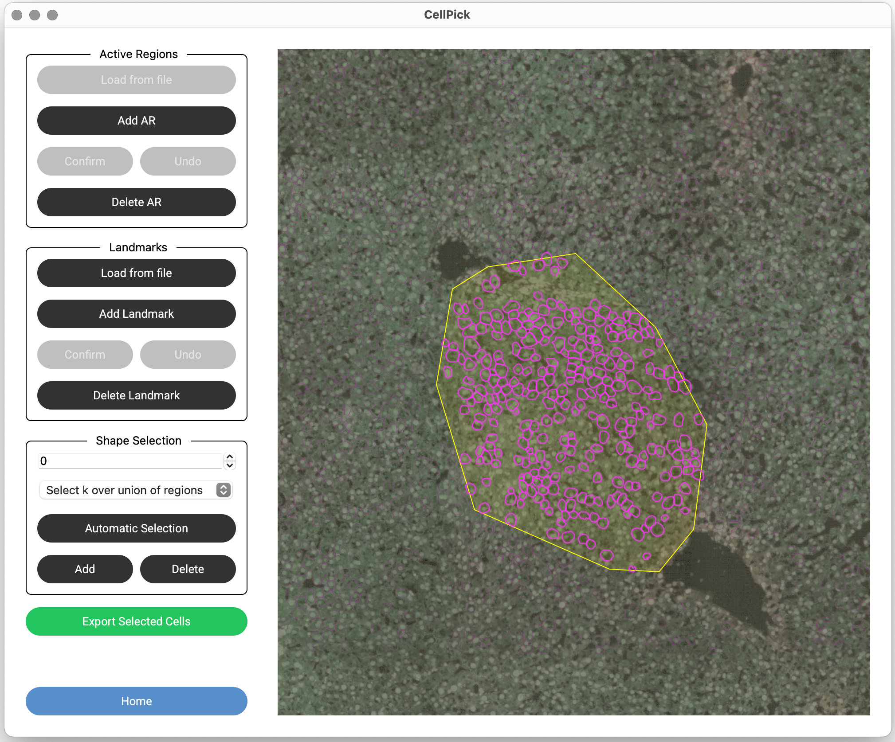

Step 6: Active Region Selection
================================

To select and score cells, you must first define one or more **Active Regions (ARs)**. Only cells within active regions will be considered for selection.

Adding an Active Region
-----------------------

1. Click **"Add AR"** to enter selection mode
2. **Right-click** on the image to add points defining the region boundary
3. Points will be highlighted in yellow as you add them
4. Click **"Confirm"** when done (minimum 3 points required)
5. The AR will appear as a semi-transparent polygon

.. raw:: html

   

Managing Active Regions
-----------------------

- **Delete Last Point**: While adding an AR, click **"Undo"** to remove the last point
- **Delete Active Region**: Click **"Delete AR"**, then right-click on an AR to remove it
- **Load from File**: Click **"Load from File"** to import ARs from a previously saved XML file
- You can create **multiple ARs** to select cells from different regions
