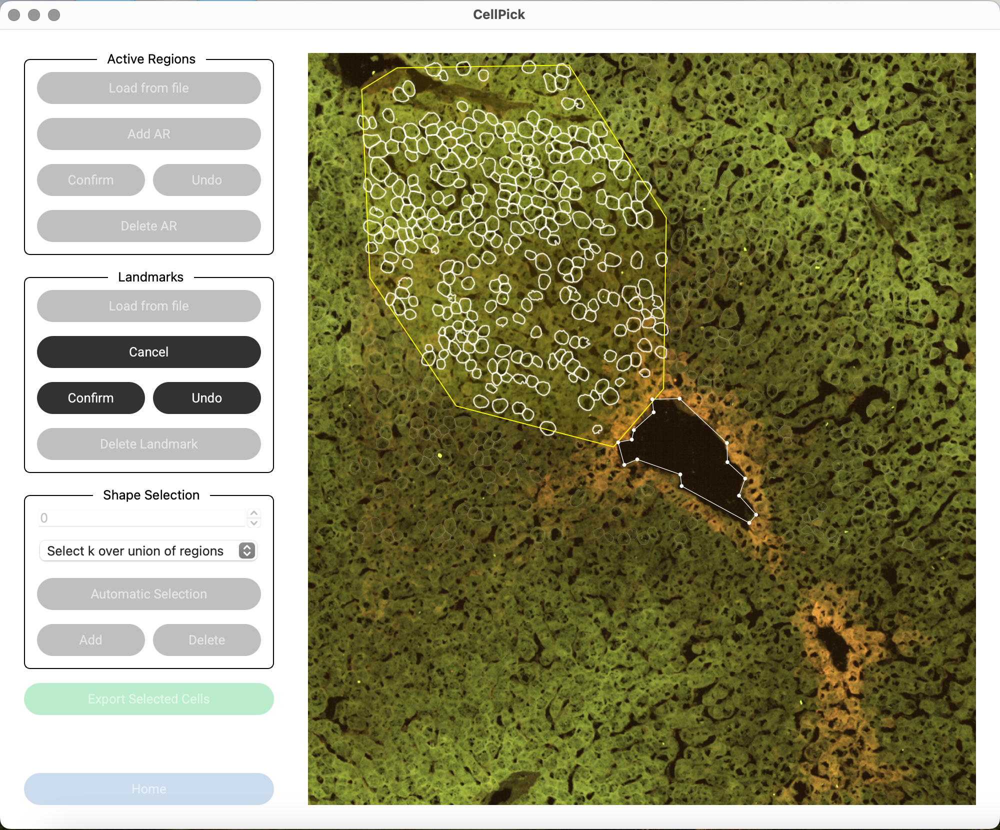
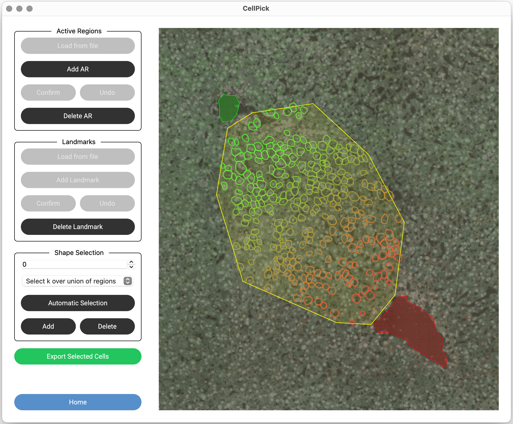

Step 7: Landmark Selection (Optional)
=====================================

Landmarks define a spatial gradient for scoring cells. Adding two landmarks allows CellPick to assign a score to each cell based on its position between the landmarks.

Adding Landmarks
----------------

1. Click **"Add Landmark"** to enter selection mode
2. **Right-click** on the image to add points defining the landmark boundary
3. Click **"Confirm"** when done (minimum 3 points required)
4. Repeat for the second landmark

.. raw:: html

   

Gradient Scoring
----------------

After adding **both** landmarks:

- Each cell is automatically assigned a score based on its distance to both landmarks
- Cells closer to landmark 1 receive a **lower score** (rendered in red)
- Cells closer to landmark 2 receive a **higher score** (rendered in green)
- Cells equidistant from both landmarks have a score near 0.5

.. raw:: html

   

Managing Landmarks
------------------

- **Delete Last Point**: While adding, click **"Undo"** to remove the last point
- **Delete Landmark**: Click **"Delete Landmark"**, then right-click on a landmark to remove it
- **Load from File**: Click **"Load from File"** to import landmarks from a previously saved XML file

.. note::
   If both labels and landmarks are loaded, you can toggle between label colors and gradient colors using **View → Show Gradient** or the keyboard shortcut **⌘+Shift+G** (Mac) / **Ctrl+Shift+G** (Windows/Linux).
