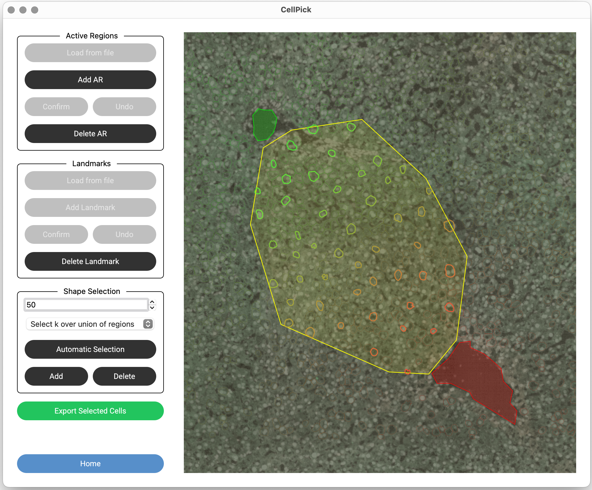
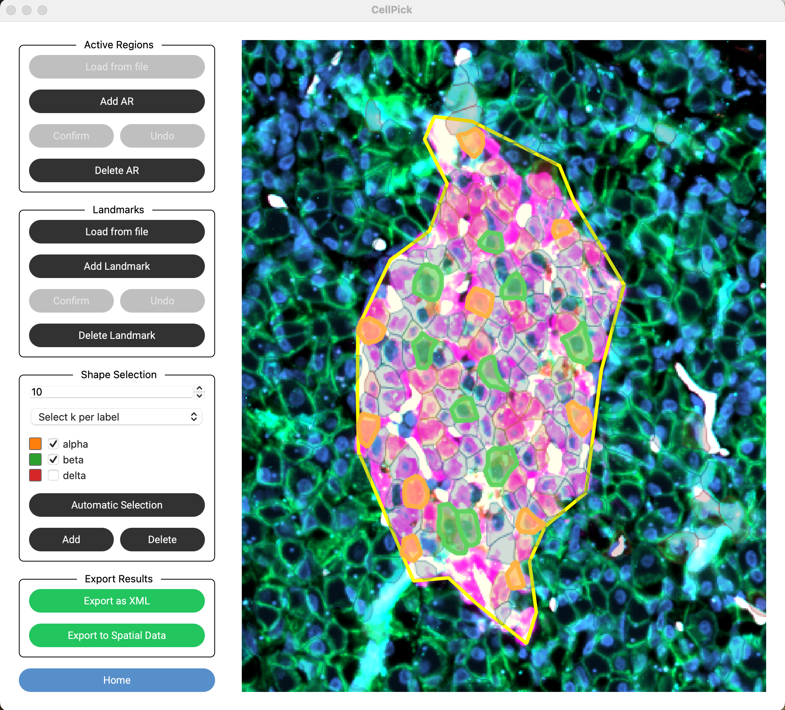

Step 8: Shape Selection
=======================

With active regions defined, you can now select cells using various algorithms.

Selection Methods
-----------------

CellPick offers four selection methods (available in the dropdown):

1. **Select k over union of regions**: Uses the Gonzalez k-center algorithm to select k cells distributed across all active regions combined. This maximizes spatial coverage while ensuring selected cells are not contiguous.

2. **Random**: Randomly selects k cells from all active regions.

3. **Select k per region**: Selects k cells from **each** active region independently, using the k-center algorithm per region.

4. **Select k per label**: (Requires loaded labels) Selects k cells from each cell type label. Only visible when labels are loaded.

.. raw:: html

   

Automatic Selection
-------------------

1. Enter the desired number of cells in the **k** spinner
2. Select a method from the dropdown
3. If using "Select k per label", check/uncheck labels to include/exclude
4. Click **"Automatic Selection"**
5. Selected cells will be highlighted in the image

.. raw:: html

   

.. image:: ../_assets/workflow_step9_multiple_regions.png
   :alt: Multiple Active Regions with selected cells
   :width: 800

.. raw:: html

   

.. image:: ../_assets/workflow_step10_per_region.png
   :alt: Per-region selection across multiple active regions
   :width: 800

.. raw:: html

   

Manual Editing
--------------

After automatic selection, you can manually refine your selection:

- **Add Shapes**: Click **"Add"**, then right-click on a cell to add it to the selection
- **Remove Shapes**: Click **"Delete"**, then right-click on a selected cell to remove it

.. warning::
   CellPick will warn you if selected shapes are contiguous (touching). For laser microdissection, non-contiguous cells are typically required.
